# Overview

Vulnerability: **Insecure Direct Object References (IDOR)**

**Learning Objective**: Understand why IDOR happens and why it's important to prevent this security flaw

**Lesson Description** - A learner can login as a user, access that user's personal data, identify a security gap, and access data belonging to another user. Subsequently, explain how to properly address the vulnerability

**Application Overview** - An express.js app serving an index.html as the frontend and a backend server primarily providing documents for the corresponding user. The vulnerability exists because the backend doesn't confirm ownership of clients with objects it provides

# Instructions

## Insecure Direct Object Reference

**IDOR** is a security vulnerability where an unauthorized client is able to access an object (i.e. documents, data) they should not have access to

## Why IDOR is important

Suppose you have personal or confidential information that only you or few others should have the privilege of knowing, only shared for important purposes such as identification, i.e. your social security number

For example if you are a patient at a hospital and want to download the latest medical exam results, it's mandatory to ensure that your medical documents are only downloadable by you and anyone else who may have the appropriate permissions, such as your personal doctor, and they should not be accessible by others.

# Sample Application

### Running the application

Let's assume you have an account on a website, can sign in and would like to access your personal information.

Download and run the application with the commands below, **NOTE**: by default it runs on port **3001**

```
git clone https://github.com/c-x-g/security_journey_work_sample.git
npm install
node app.js # you can also use nodemon if you have it for convenience
```

On your browser, navigate to **http://localhost:3001**

In this example you can either login as **Alice** or **Bob** (Please only use these names)

If you login as Alice and click on the **View Personal Information** button, you can see Alice's personal information

<div style="display:flex">
    <div style="margin-right:50px">
    <p>1.</p>
  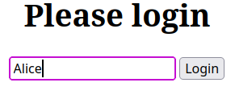
    </div>
  <div style="margin-right:50px">
  <p>2.</p>
  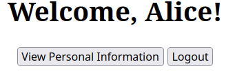 
</div>
  <div>
  <p>3.</p>
  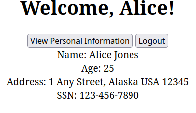
  </div>
</div>

Respectively, you can do the same for Bob and see his information as well

<div style="display:flex">
    <div style="margin-right:50px">
    <p>1.</p>
  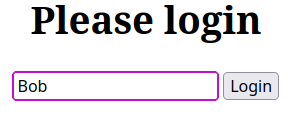
    </div>
  <div style="margin-right:50px">
  <p>2.</p>
  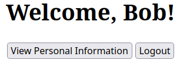 
</div>
  <div>
  <p>3.</p>
  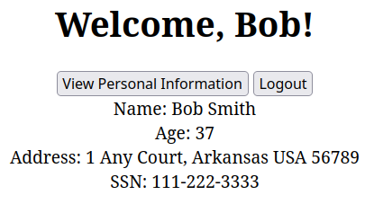
  </div>
</div>

### Where the vulnerability lies

On the surface, this looks innocuous and reasonable as each user logs in normally and is able to see their respective information.
However if the application is insecure, a attacker looking for security cracks can infer from the network requests that there is a possibility that the backend is potentially compromised

1. With your browser webpage focused on the webpage generated by the local application, open developer tools by either entering **Ctrl+Shift+I** or right-click the browser and click on 'Inspect' and open the Network tab. In this example I've used Chrome:

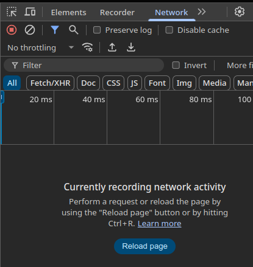

2. With developer tools open and while logged in as either Alice or Bob, click on **View Personal Information** again. Notice how a request shows up in the network activity, here it shows **documents?name=Alice**
   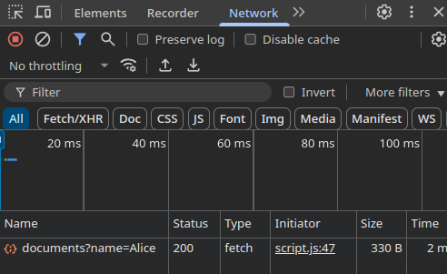

3. Suppose that an attacker manages to figure out a list of account names and also discovers this information. If the backend is insecure, through tinkering they can possibly run http requests to retrieve any of the accounts' personal information, even if they aren't logged into the account! Through this method, the attacker can access both Alice's and Bob's information simultaneously, despite not being logged in as either!

4. Through Postman, using the path we found in the prior step, enter the url to retrieve Alice's information and run it: http://localhost:3001/documents?name=Alice . Alternatively we can do the same to also get Bob's information: http://localhost:3001/documents?name=Bob

<p>
<div style="display:flex">
    <div style="margin-right:200px;">
    <p>Alice</p>
    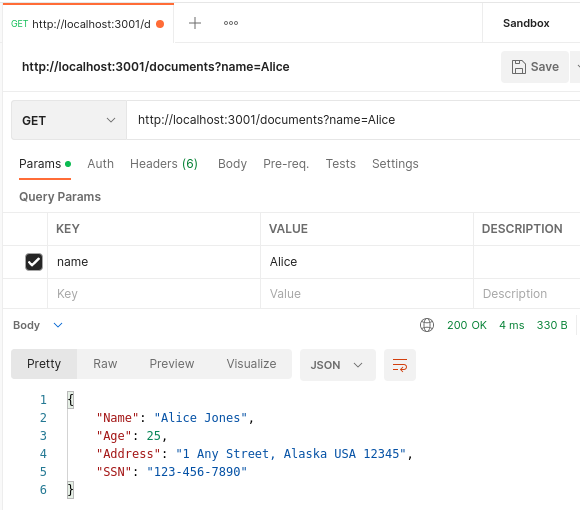
    </div>
        <div>
    <p>Bob</p>
    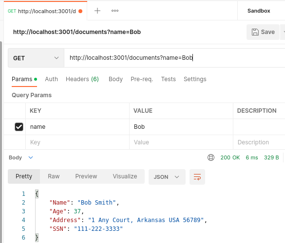
    </div>
</div>
</p>

5. This illustrates the issue with IDOR; through bypassing the webpage and directly querying the backend endpoint, if it is not secured, an attacker can indirectly access information that doesn't belong to them

### Securing the application

Some caveats:

1. In practice do not store session data in localStorage directly as I have done here for demonstration.
   Instead use http-only cookies to prevent cross-site scripting; this is usually handled directly by a third party service
2. When the backend decodes the token, a secret value (usually an environment variable) should be used for additional security, otherwise if the token is decoded directly, too much trust is placed on the client even if it may be compromised

To demonstrate how to prevent IDOR, checkout to the security-fix branch which has the updated code and restart the application

```
git checkout security-fix
# restart the application: Ctrl+C
node app.js
```

## Code Changes

Newly added in app.js are a pair of token functions, one to create a token representing a user's login session, and another to authenticate the token and extract the user from it. In practice this is usually done by a third party library that creates JWT tokens and manages their sessions. Notice that there is also a secret value which should not be visible outside of the server, this is used to sign the JWT token as standard good practice.

<p><b>Token Functions</b></p> 
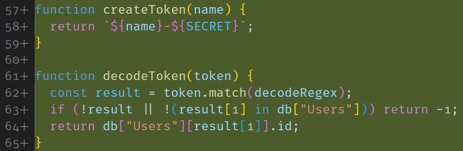

<p><b>Token Secret</b></p> 
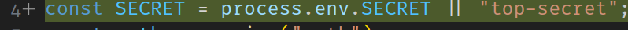

Additionally script.js now includes additional code to store a token received from the server, and use it for subsequent requests to control access to documents

For simplicity I have expressed the token as a concatenation of the user's name and secret and the decode method as matching this pattern and extracting the user's name from the pattern

To determine proper access I have also added **OwnerId** fields to each document in database.json, representing who has the privilege to access the specific document

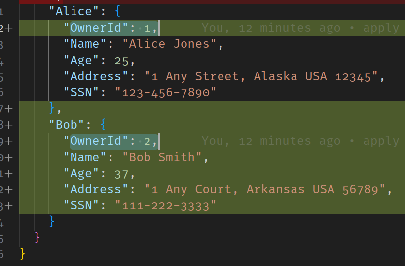

**How the token prevents IDOR**

The added token is now expected as a header in the **/documents** handler and access is much more <u>tightly controlled</u> now using the token, below are newly introduced conditions:

- if a token isn't provided, return 401 unauthorized status code and inform client of missing token
  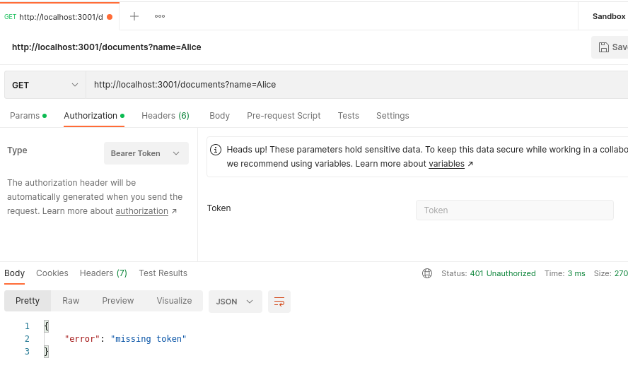
- if the token is poorly formatted, return a 401 status and inform client of invalid token
  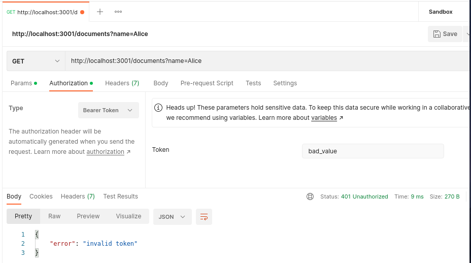

- if the token is satisfactory, extract the client's name and lookup their id. Additionally look up the document's OwnerId\*\* and ensure that the two match, if they do then the client has appropriate access to the document and it can be returned, however if there is a mismatch, return a 403 access denied status

<p><b>Alice can use her token to access her own information</b></p> 
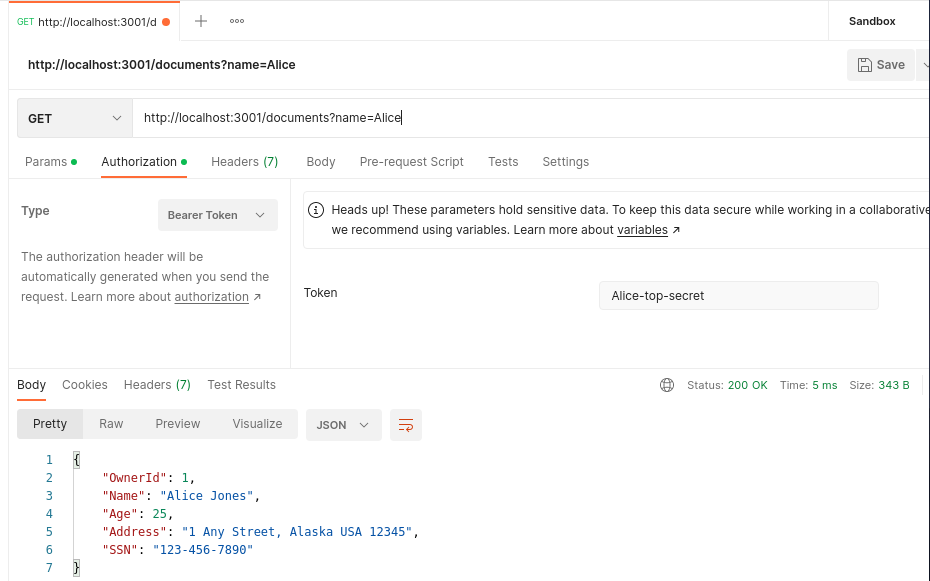

<p><b>Notice how Alice cannot use her token to access Bob's information</b></p> 
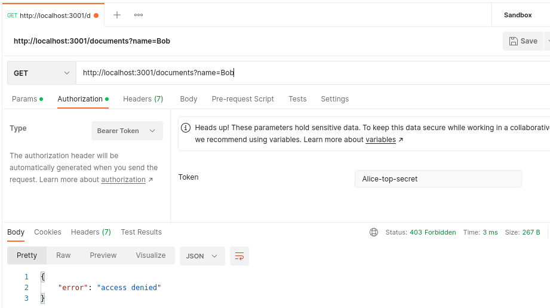

**Warning:**
The token shown here is not intended to be directly accessed and should be secured in a real application. Using the token directly like this is exclusively for demonstration purposes

### Summary

**IDOR** is a vulnerability where the server is compromised and an attacker can directly retrieve documents that don't belong to them from it.

To prevent **IDOR**, the server should authenticate every client, identify the client Id, and confirm that the client Id has the privilege to access the document it is requesting by confirming that the client Id is indeed the owner of the document
